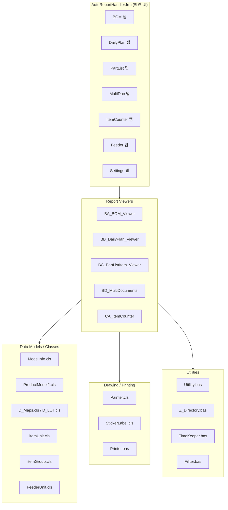

# VBA 소스 코드 분석 리뷰

> **분석 대상**: `d:\Workshop\LARS\VBA\Original.md` (6,739줄)
> **분석 목적**: C# 재구현을 위한 원본 VBA 비즈니스 로직 완전 파악

---

## 1. 전체 아키텍처 개요



### VBA 모듈 파일 구성

| 분류 | 모듈명 | 라인수(약) | 핵심 역할 |
|------|--------|-----------|----------|
| **Module** | `BA_BOM_Viewer.bas` | ~270 | BOM 스캔/가공/인쇄 |
| **Module** | `BB_DailyPlan_Viewer.bas` | ~500 | DailyPlan 스캔/가공/모델그루핑/인쇄 |
| **Module** | `BC_PartListItem_Viewer.bas` | ~540 | PartList 스캔/가공/파트병합/인쇄 |
| **Module** | `BD_MultiDocuments.bas` | ~40 | DailyPlan+PartList 교차매핑 |
| **Module** | `CA_itemCounter.bas` | ~410 | PartList→itemCounter 파이프라인 |
| **Module** | `BCA_PLIV_Feeder.bas` | ~160 | Feeder 관리/필터링 |
| **Module** | `Utillity.bas` | ~770 | 파일검색/파싱/UI유틸리티 |
| **Module** | `Z_Directory.bas` | ~45 | 디렉토리 경로 관리 |
| **Module** | `Printer.bas` | ~200 | 인쇄 설정/실행 |
| **Module** | `TimeKeeper.bas` | ~400 | 날짜/시간 파싱/병합 |
| **Module** | `Fillter.bas` | ~50 | BOM 레벨 필터링 |
| **Class** | `ModelInfo.cls` | ~115 | 모델명 파싱 (Type/Spec/Color/Suffix) |
| **Class** | `ProductModel2.cls` | ~120 | Previous/Current/Next 모델 비교 |
| **Class** | `D_Maps.cls` | ~85 | Main/Sub Group 컬렉션 관리 |
| **Class** | `D_LOT.cls` | ~90 | LOT 범위(Start_R~End_R) + ModelInfo 파싱 |
| **Class** | `itemUnit.cls` | ~205 | 자재 단위 + 날짜별 Count 인덱서 |
| **Class** | `itemGroup.cls` | ~220 | itemUnit 컬렉션 + 압축/병합 |
| **Class** | `StickerLabel.cls` | ~530 | Excel Shape 기반 라벨 드로잉 |
| **Class** | `Painter.cls` | ~380 | OvalBridge/DotMaker/Stamp 드로잉 |
| **Class** | `FeederUnit.cls` | ~35 | Feeder 이름+아이템 목록 |
| **Form** | `AutoReportHandler.frm` | ~510 | 메인 UI (탭/체크박스/ListView/프로그레스바) |

---

## 2. 핵심 비즈니스 로직 상세

### 2.1 BA_BOM_Viewer — BOM 처리

#### 파일 스캔 로직
```
FindFilesWithTextInName(Z_Directory.Source, "@CVZ")
```
- **Source 경로**에서 파일명에 `@CVZ`가 포함된 파일을 모두 찾음
- C# 대응: `FileSearcher.FindFiles(path, "@CVZ")`

#### 모델명 추출 (`GetModelName`)
- 별도 Excel 인스턴스 생성 → 파일 열기 → `ws.Cells(2, 3).Value` 읽기
- `@` 기호 앞부분을 모델명으로 사용
- C# 대응: `ExcelReaderService.FindCell()` 활용

#### AutoReport_BOM 가공 파이프라인
1. **열 필터링**: `ColumnsForReport` 컬렉션에 없는 열 삭제
2. **레벨 필터링**: `FilterByLevel` — BOM Level(`0`, `.1`, `..2`, `...3`, `*S*`, `*Q*`) 기준 행 필터링
3. **인테리어 설정**: 테두리/폰트/색상/열너비
4. **인쇄 설정**: `PS_BOM` — A4 세로, 머리글에 날짜+페이지번호

#### C# 현황 비교

| VBA 기능 | C# 구현 상태 | 비고 |
|----------|-------------|------|
| `@CVZ` 패턴 스캔 | ✅ `BomReportService.ScanBomFiles()` | 동일 패턴 |
| `GetModelName` 셀 읽기 | ✅ `ExcelReaderService` | Cells(2,3) 매핑 확인 필요 |
| `ColumnsForReport` 필터 | ⚠️ 부분 구현 | 열 목록 하드코딩 여부 확인 |
| `FilterByLevel` | ⚠️ 부분 구현 | BOM Level 문자열 매칭 로직 |
| 인쇄/PDF 출력 | ✅ `PdfExportService` | |

---

### 2.2 BB_DailyPlan_Viewer — DailyPlan 처리

#### 파일 스캔 로직
```
FindFilesWithTextInName(Z_Directory.Source, "Excel_Export_")
```
- Source 경로에서 파일명에 `Excel_Export_`가 포함된 파일 검색

#### 날짜 추출 (`GetDailyPlanWhen`)
- 별도 Excel 인스턴스로 파일 열기
- **Row 2**에서 `*월`로 끝나는 셀을 찾아 월 정보 추출
- **Row 3**에서 해당 월 범위 내 최소 날짜값 추출
- 결과: `"*월-*일"` 형식의 제목 + `wLine`(생산 라인) 변수 설정

#### AutoReport_DailyPlan 가공 파이프라인
1. **`SetUsingColumns`**: 보존할 열 정의 — `W/O`, `부품번호`, `W/O 계획수량`, `W/O Input`, `W/O실적`
2. **`AR_1_EssentialDataExtraction`**: 불필요 열 삭제 (IsInCollection 기반), 투입시점 병합
3. **`AR_2_ModelGrouping`**: Main/Sub Group 경계 탐지
   - `ProductModel2.Compare2Models()` 사용
   - 비교 기준: `mif_SpecNumber` → `mif_TySpec` → `mif_Species` 순서 폴백
   - `D_Maps`에 Main_Lot/Sub_Lot 범위 저장
4. **`MarkingUp`**: `Painter.Stamp_it_Auto()` 호출 → 모델 그룹 시각화(OvalBridge Shape)
5. **`Interior_Set_DailyPlan`**: 테두리/폰트/색상/열너비 설정 + 요일별 칼러링(토/일/평일)
6. **`DecodeDate`/`DatePartLining`**: 날짜 디코딩 + 주차 경계선

#### C# 현황 비교

| VBA 기능 | C# 구현 상태 | 비고 |
|----------|-------------|------|
| `Excel_Export_` 스캔 | ✅ `DailyPlanService.ScanDailyPlanFiles()` | |
| `GetDailyPlanWhen` 날짜추출 | ⚠️ 부분 구현 | Row2 `*월` 패턴 + Row3 최소값 로직 |
| `SetUsingColumns` | ⚠️ 미확인 | 열 이름 매핑 정확성 |
| `AR_1_EssentialDataExtraction` | ⚠️ 부분 구현 | 투입시점 병합 등 |
| `AR_2_ModelGrouping` | ⚠️ 미구현 가능성 | `Compare2Models` 3단계 폴백 로직 |
| `MarkingUp` Shape 드로잉 | ❌ WPF에서 불필요 | Shape 대신 UI 시각화 |

---

### 2.3 BC_PartListItem_Viewer — PartList 처리

#### 파일 스캔 로직
```
FindFilesWithTextInName(Z_Directory.Source, "Excel_Export_")
```
- DailyPlan과 동일한 패턴이지만 내부 데이터 구조가 다름

#### 날짜 추출 (`GetPartListWhen`)
- **Row 1**에서 `YYYYMMDD` 헤더 셀 검색
- Row 2의 YYYYMMDD 값에서 `MM월-DD일` 형식 생성
- `wLine` = `Line` 헤더의 아래 셀 값
- D-Day 카운트(DDC) 계산: 날짜 변경 횟수 카운트
- **`vCFR`** = 부품명 고유 리스트 수집 (`PartCollector(Unique)`)

#### AutoReport_PartList 가공 파이프라인
1. **`SetUsingColumns`**: `투입\n시점`, `W/O`, `모델`, `Suffix`, `계획 수량`, `Tool`
2. **`AR_1_EssentialDataExtraction`**: ★ 가장 복잡한 로직
   - `MergeDateTime_Flexible`: YYYYMMDD + Input Time → 투입시점 병합
   - **D-Day N일 트리밍**: `DayCount` 기준으로 N일차까지만 남기고 나머지 삭제
   - 불필요 열 삭제 (`IsInCollection` 기반)
   - **모델+Suffix 병합**: `ws.Cells(i, CritCol).Value & "." & ws.Cells(i, CritCol).Offset(0,1).Value`
   - **`PartCombine`**: 동일 부품명을 가진 열들의 데이터를 합치고 잉여 열 삭제
   - **`DeleteDuplicateRowsInColumn`**: W/O 중복 행 제거 + 수량 합산
   - **`Replacing_Parts`**: 벤더명 정규화 + 특수 예외처리(Burner 매핑)
3. **`Interior_Set_PartList`**: 테두리/폰트/색상 설정
4. **`AR_2_ModelGrouping`**: Sub Group 경계 탐지  
5. **`MarkingUP_PL`**: Sub Group 시각화 (Stamp_it_Auto)

#### C# 현황 비교

| VBA 기능 | C# 구현 상태 | 비고 |
|----------|-------------|------|
| 파일 스캔 | ✅ `PartListService.ScanPartListFiles()` | |
| `GetPartListWhen` | ⚠️ | YYYYMMDD 패턴 인식 |
| `MergeDateTime_Flexible` | ⚠️ | TimeKeeper 로직 |
| D-Day N일 트리밍 | ❓ 미확인 | 핵심 데이터 필터 |
| 모델+Suffix 병합 | ❓ 미확인 | |
| `PartCombine` | ❓ 미확인 | 동일 부품 열 합치기 |
| `DeleteDuplicateRowsInColumn` | ❓ 미확인 | W/O 중복 행 제거+합산 |
| `Replacing_Parts` | ❓ 미확인 | 벤더 정규화/예외처리 |

---

### 2.4 CA_itemCounter — PartList→ItemCounter 파이프라인

#### 핵심 API: `PL2IC(PartList_Directory)`
```
1. Get_Reference(PartList_Directory)   → rWB/rWS 바인딩
2. 스캔 범위: "-Line" 기준으로 rTitle, rS, rE, cS, cE 계산
3. PL_iU_Reader(rS, cS, rE, cE)       → Collection(Collection(itemUnit))
4. PL_Compressor(itemsRaw)             → Collection(itemUnit)  [ID_Hash 병합]
5. Writing_itemCounter_from_PL(items)  → 워크시트에 출력
```

#### PL_iU_Reader — 셀 텍스트 → itemUnit 분해
- `투입\n시점` 열(cDates)과 `수량` 열(cCounts) 위치 동적 탐색
- 각 셀의 텍스트를 `Re_Categorizing()`으로 분해

#### Re_Categorizing — 셀 문자열 파싱 ★핵심★
입력 예: `[기미] 4102/4202(2)/4502 [SABAF S.P.A.] 6904/7302`

```
1. " [" → "$[" 치환 후 "$" 기준 Split → Vendor별 분리
2. 각 Vendor: ExtractBracketValue() → 벤더명 추출
3. 나머지 텍스트를 "/" 기준 Split → 파트넘버별 분리
4. "()" 안의 값 → QTY (없으면 1)
5. itemUnit 생성: NickName, Vendor, PartNumber, QTY 설정
6. Count(InputDate) = LotCounts × QTY
```

#### PL_Compressor — ID_Hash 기준 병합
- `ID_Hash = Vendor + "_" + NickName + "_" + PartNumber`
- 동일 Hash → `MergeCountsFrom()` (날짜별 Count 합산)
- 신규 Hash → 결과 컬렉션에 추가

#### C# 현황 비교

| VBA 기능 | C# 구현 상태 | 비고 |
|----------|-------------|------|
| `PL2IC` 엔트리 | ✅ `ItemCounterService` | |
| `Re_Categorizing` 파싱 | ⚠️ | 벤더/파트넘버/QTY 분해 로직 정확성 |
| `PL_Compressor` 병합 | ⚠️ | `ItemGroup.AddUnit` 대응 |
| 날짜별 Count | ✅ `ItemUnit.Count Dictionary` | |
| `Writing_itemCounter` | ⚠️ 미확인 | |

---

### 2.5 Utility 모듈 (`Utillity.bas`) — 공통 유틸리티

#### 파일/디렉토리 처리
| 함수명 | 기능 | C# 대응 |
|--------|------|---------|
| `FindFilesWithTextInName(dir, text)` | 파일명에 특정 텍스트 포함 파일 검색 | `FileSearcher.FindFiles()` |
| `SaveFilesWithCustomDirectory()` | XLSX/PDF 저장 + 원본 삭제 | `PdfExportService` + 파일 관리 |
| `CheckFileAlreadyWritten_PDF()` | 기존 PDF 존재 여부 확인 | 파일 체크 로직 |

#### 데이터 유틸리티
| 함수명 | 기능 | C# 대응 |
|--------|------|---------|
| `IsInCollection(val, col)` | 컬렉션 내 존재 확인 | `List.Contains()` |
| `ExtractBracketValue(text)` | `[...]` 내부 텍스트 추출 | `StringParser` |
| `ExtractSmallBracketValue(text)` | `(...)` 내부 텍스트 추출 | `StringParser` |
| `DeleteDuplicateRowsInColumn()` | 중복 행 제거 + 값 합산 | 서비스 레이어 |
| `GetRangeBoundary(range)` | Range의 행/열 경계 추출 | 불필요 (LINQ 대체) |
| `fCCNEC(range)` | 연속 비어있지 않은 셀 카운트 | 불필요 |
| `RemoveLineBreaks(text)` | 줄바꿈 문자 제거 | `string.Replace()` |

#### 파싱/정규식
| 함수명 | 기능 | C# 대응 |
|--------|------|---------|
| `ParseMDToken(fullPath)` | 파일명에서 날짜/라인/문서타입 추출 | `FileMetadata.Parse()` |
| `BuildKeyFromPath(path)` | `yyyy-mm-dd|C##` 정규화 키 생성 | `MultiDocService` |
| `WeekdayKorean(date)` | 한국어 요일 반환 | `DateTimeParser` |
| `RxFirst(pattern, text)` | 정규식 첫 매치 추출 | `Regex.Match()` |

#### ListView 처리
| 함수명 | 기능 | C# 대응 |
|--------|------|---------|
| `FillListView_ByFilter()` | 필터링된 파일 목록 ListView에 채움 | MVVM `ObservableCollection` |
| `FillListView_Intersection()` | 두 컬렉션의 교집합 ListView에 채움 | `MultiDocService.MatchFiles()` |
| `GetFoundSentences()` | 파일명 패턴 매칭 | `FileMetadata` |

---

### 2.6 Z_Directory — 경로 관리

```vba
Source = Setting 시트의 "Source" 셀 값 (외부 파일 소스 경로)
BOM = ThisWorkbook.Path & "BOM"
DailyPlan = ThisWorkbook.Path & "DailyPlan"
PartList = ThisWorkbook.Path & "PartList"
Feeder = ThisWorkbook.Path & "Feeder"
```

C# 대응: `DirectoryManager` + `SettingsService`

---

### 2.7 TimeKeeper — 날짜/시간 처리

#### `MergeDateTime_Flexible(ws, dateCol, targetCol, timeCol)`
- YYYYMMDD + 시간 텍스트 → Date 직렬값 병합
- 다양한 포맷 지원: `YYYYMMDD`, `오전/오후 HH:MM:SS`, `hhmmss`
- `NormalizeKoreanAmPm()`: 오전→AM, 오후→PM 치환

#### `Time_Filtering(StartDT, EndDT)`
- 제외시간 컬렉션(예: 00:00~08:00, 10:00~10:10, 12:00~13:00 등)
- 순 작업시간 계산 (C# 대응 필요 여부 미정)

C# 대응: `DateTimeParser` (부분 구현)

---

### 2.8 Painter/StickerLabel — Shape 드로잉 (C# 직접 대응 불필요)

- **Painter.cls**: `OvalBridge()`, `Stamp_it()`, `Stamp_it_Auto()`, `DotMacker()`
- **StickerLabel.cls**: `Left/Right/Up/Down()`, `SingleLabel()`, `StickerLabelVertical/Side()`
- Excel Shape COM 객체 기반 — C# WPF에서는 DataGrid/ListView 시각화로 대체

---

## 3. 데이터 흐름도

### 3.1 BOM 파이프라인
```
Source 폴더 → @CVZ 스캔 → GetModelName → AutoReport_BOM
    → 불필요 열 삭제 → Level 필터 → Interior 설정 → 인쇄/PDF
```

### 3.2 DailyPlan 파이프라인  
```
Source 폴더 → Excel_Export_ 스캔 → GetDailyPlanWhen → AutoReport_DailyPlan
    → SetUsingColumns → AR_1 (열 가공) → AR_2 (ModelGrouping)
    → MarkingUp (Shape) → Interior 설정 → 인쇄/PDF
```

### 3.3 PartList 파이프라인
```
Source 폴더 → Excel_Export_ 스캔 → GetPartListWhen → AutoReport_PartList
    → SetUsingColumns → AR_1 (투입시점 병합 + D-Day 트리밍 + 모델Suffix 병합
                          + PartCombine + 중복행 제거 + Replacing_Parts)
    → Interior 설정 → AR_2 (ModelGrouping) → MarkingUP_PL → 인쇄/PDF
```

### 3.4 ItemCounter 파이프라인
```
PartList 파일 → PL2IC → Get_Reference → 스캔 범위 계산
    → PL_iU_Reader (셀→itemUnit 분해)
    → Re_Categorizing (벤더/파트넘버/QTY 파싱)
    → PL_Compressor (ID_Hash 병합, 날짜별 Count 합산)
    → Writing_itemCounter_from_PL (워크시트 출력)
```

### 3.5 MultiDocument 교차매핑
```
DailyPlan 폴더 + PartList 폴더
    → 파일명에서 ParseMDToken (날짜/라인 추출)
    → BuildKeyFromPath (yyyy-mm-dd|C## 키)
    → FillListView_Intersection (교집합 매칭)
```

---

## 4. VBA → C# 이관 우선순위 및 갭 분석

### 4.1 ★ 이관 필수 — 핵심 비즈니스 로직

| 우선순위 | VBA 함수/서브루틴 | 복잡도 | C# 구현 상태 | 필요 작업 |
|---------|-----------------|--------|-------------|----------|
| **P0** | `AR_1_EssentialDataExtraction` (PartList) | ★★★★★ | ❓ | 전체 파이프라인 검증 필요 |
| **P0** | `Re_Categorizing` (CA_itemCounter) | ★★★★ | ⚠️ | 벤더/파트 파싱 로직 정밀 검증 |
| **P0** | `PL_Compressor` / `MergeCountsFrom` | ★★★ | ⚠️ | ID_Hash 병합 로직 |
| **P1** | `AR_1_EssentialDataExtraction` (DailyPlan) | ★★★★ | ⚠️ | 열 필터/투입시점 처리 |
| **P1** | `AR_2_ModelGrouping` | ★★★★ | ❓ | 3단계 폴백 비교 로직 |
| **P1** | `GetDailyPlanWhen` / `GetPartListWhen` | ★★★ | ⚠️ | 날짜 추출 정확성 |
| **P2** | `PartCombine` + `CCBC` | ★★★ | ❓ | 동일 부품 열 합치기 |
| **P2** | `Replacing_Parts` | ★★★ | ❓ | 벤더명 정규화 + Burner 예외 |
| **P2** | `DeleteDuplicateRowsInColumn` | ★★ | ❓ | 중복 W/O 행 제거+합산 |
| **P3** | `MergeDateTime_Flexible` | ★★★ | ⚠️ | 다양한 포맷 파싱 |
| **P3** | `FilterByLevel` (BOM) | ★★ | ⚠️ | Level 문자열 매칭 |
| **P3** | `FillListView_Intersection` | ★★ | ✅ | `MultiDocService.MatchFiles()` |

### 4.2 이관 불필요 — WPF에서 다르게 처리

| VBA 기능 | 이유 | C# 대안 |
|----------|------|---------|
| `Painter.cls` / `StickerLabel.cls` | Excel Shape COM 의존 | WPF DataGrid/Canvas |
| `Interior_Set_*` 서식 설정 | Excel 셀 서식 | WPF 스타일/테마 |
| `AutoPageSetup` / `PrintOut` | Excel 인쇄 | `PdfExportService` |
| `ControlLot` 색상 관리 | Excel 셀 색상 | WPF 바인딩 |
| `SendMessage` (Win32 API) | ListView 열너비 | WPF GridView |

---

## 5. 핵심 발견사항

### 5.1 🔴 파일 스캔의 진짜 로직 (사용자 우려사항 관련)

VBA에서 파일이 **실제 데이터를 포함하는지** 확인하는 방식:

1. **BOM**: `GetModelName()` — 파일을 열어서 `ws.Cells(2,3).Value`에 모델명이 있는지 확인
2. **DailyPlan**: `GetDailyPlanWhen()` — Row 2에서 `*월` 패턴 셀 + Row 3에서 수치 > 0 확인 → 없으면 `"It's Not a DailyPlan"` 반환
3. **PartList**: `GetPartListWhen()` — Row 1에서 `YYYYMMDD` 헤더 확인 → 없으면 `"It's Not a PartList"` 반환

**→ C#에서도 파일을 열어 실제 데이터 존재 여부를 검증하는 로직이 필요합니다.**

### 5.2 🔴 핵심 가공 로직의 복잡성

`AR_1_EssentialDataExtraction`(PartList)는 **가장 복잡한 단일 함수**로, 다음을 한 번에 수행:
- 날짜+시간 병합 (`MergeDateTime_Flexible`)
- D-Day N일 트리밍
- 불필요 열 삭제
- 모델+Suffix 병합
- 동일 부품 열 합치기 (`PartCombine`)
- 중복 행 제거+합산 (`DeleteDuplicateRowsInColumn`)
- 벤더 정규화 (`Replacing_Parts`)
- 라인명 삽입

C# 구현 시 이 로직을 여러 메서드로 분리하되, **호출 순서와 부작용(열/행 삭제)을 정확히 재현**해야 합니다.

### 5.3 🟡 ModelGrouping의 3단계 폴백

`AR_2_ModelGrouping`에서 모델 비교 시:
```
1차: SpecNumber 비교 (LSGL6335)
2차: TySpec 비교 (LS6335) — Species ≠ "LS63"일 때만
3차: Species 비교 (LS63)
```
이 폴백 로직이 C#에 정확히 구현되었는지 확인 필요.

### 5.4 🟡 Burner 특수 예외처리

`Replacing_Parts`에서 Burner 열은 벤더/파트 조합에 따라 하드코딩된 매핑 적용:
```vba
Case "[기미] 4102/4202/4402/4502"  → "[피킹] Oval/Best"
Case "[기미] 4102/4202/4402/4502 [SABAF S.P.A.] 6904/7302"  → "[피킹] Oval/Best/Sabaf"
```
C# 구현 시 이 예외 처리가 누락될 위험이 높습니다.

---

## 6. 데이터 모델 대응표

| VBA Class | C# Model | 핵심 차이점 |
|-----------|----------|------------|
| `ModelInfo.cls` | `ModelInfo.cs` | VBA는 `ParseModelinfo` 내부 Sub, C#은 `Parse()` 팩토리 |
| `ProductModel2.cls` | `ProductModel.cs` | VBA는 Previous/Current/Next + Compare2Models |
| `D_Maps.cls` | `—` (Lot.cs에 통합) | VBA는 Main_Groups + Sub_Groups 이중 컬렉션 |
| `D_LOT.cls` | `Lot.cs` / `LotGroup.cs` | VBA는 Start_R/End_R Range 참조 |
| `itemUnit.cls` | `ItemUnit.cs` | VBA는 날짜별 Count 배열, C#은 Dictionary |
| `itemGroup.cls` | `ItemGroup.cs` | VBA은 CompressorLV1/LV2, C#은 AddUnit+Merge |
| `FeederUnit.cls` | `FeederUnit.cs (ProductModel.cs)` | 구조 유사 |

---

## 7. 결론 및 권장 조치

1. **PartList AR_1 가공 로직 완전 검증** — 가장 복잡하고 데이터 정합성에 직접 영향
2. **Re_Categorizing 파싱 로직 테스트** — 실제 PartList 셀 데이터로 단위 테스트 필수
3. **파일 스캔 시 데이터 유효성 검증 추가** — `GetDailyPlanWhen`/`GetPartListWhen` 패턴
4. **ModelGrouping 3단계 폴백 구현 확인** — SpecNumber → TySpec → Species
5. **Burner 특수 매핑 등 하드코딩 예외 이관** — 누락 위험 높음
