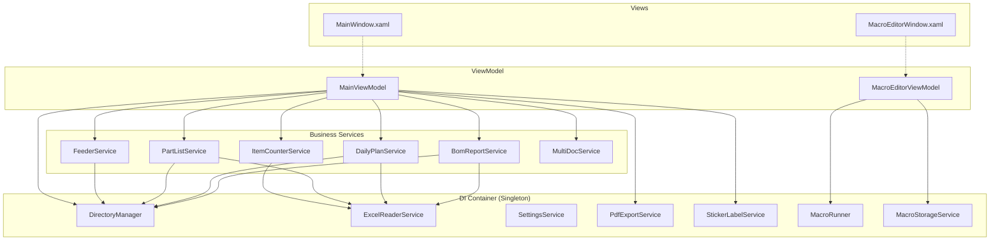

# LARS C# 코드베이스 아키텍처 리뷰

> 작성일: 2026-02-24
> 분석 대상: `d:\Workshop\LARS\` (전체 C# 소스)
> 빌드 검증: `dotnet build` → **0 Error, 0 Warning** ✅

---

## 1. 프로젝트 개요

| 항목 | 값 |
|------|---|
| **프레임워크** | .NET 8.0 (WinExe) |
| **UI** | WPF + DarkTheme |
| **MVVM** | CommunityToolkit.Mvvm 8.4.0 |
| **Excel 읽기** | ClosedXML 0.104.2 (MIT) |
| **PDF 출력** | PdfSharpCore 1.3.67 (MIT) |
| **DI** | Microsoft.Extensions.DependencyInjection 9.0.2 |
| **Nullable** | Enabled |
| **Implicit Usings** | Enabled |
| **총 C# 파일** | 27개 (Services 10 / Models 12 / ViewModels 2 / Views 4 / Utils 1 / Converters 1) |
| **총 코드 라인** | 약 4,500줄 (XAML 제외, VME 포함) |

---

## 2. 전체 시스템 아키텍처

```
┌─────────────────────────────────────────────────────────────────────────────┐
│                        App.xaml.cs (DI Container)                          │
│  ┌────────────────────────────────────────────────────────────────────────┐ │
│  │  ServiceProvider: ConfigureServices()                                 │ │
│  │  OnStartup: SettingsService.Load() → DirectoryManager.Setup()        │ │
│  │  OnExit:    SettingsService.Save()                                    │ │
│  └────────────────────────────────────────────────────────────────────────┘ │
└──────────────┬──────────────────────────────────────────┬──────────────────┘
               │                                          │
     ┌─────────▼─────────┐                    ┌───────────▼───────────┐
     │  Views (XAML/WPF)  │                    │  ViewModels (MVVM)    │
     │                    │ DataBinding         │                       │
     │  MainWindow.xaml   │◀════════════════▶│  MainViewModel.cs     │
     │  StickerLabel      │                    │  (ObservableObject)   │
     │   Dialog.xaml      │                    │  (RelayCommand)       │
     └────────────────────┘                    └───────────┬───────────┘
                                                           │
           ┌───────────┬───────────┬───────────┬───────────┼───────────┐
           │           │           │           │           │           │
     ┌─────▼────┐┌─────▼─────┐┌───▼────┐┌─────▼─────┐┌───▼────┐┌────▼──────┐
     │ BomReport ││ DailyPlan ││PartList││ItemCounter││ Feeder ││ MultiDoc  │
     │ Service   ││ Service   ││Service ││ Service   ││Service ││ Service   │
     └─────┬─────┘└─────┬─────┘└───┬────┘└─────┬─────┘└───┬────┘└────┬──────┘
           │           │           │           │           │          │
     ┌─────▼───────────▼───────────▼───────────▼─────┐     │          │
     │        ExcelReaderService (ClosedXML)          │     │          │
     └────────────────────────────────────────────────┘     │          │
                                                            │          │
     ┌──────────────────────────────────────────────────────▼─────┐    │
     │        DirectoryManager (경로 관리)                         │    │
     └───────────────────────────────────────────────────────────┘    │
                                                                      │
     ┌──────────────────────┐  ┌────────────────────┐  ┌──────────────▼───┐
     │  PdfExportService    │  │ StickerLabelService │  │  SettingsService │
     │  (PdfSharpCore)      │  │ (PdfSharpCore)      │  │  (JSON 영속성)   │
     └──────────────────────┘  └────────────────────┘  └──────────────────┘
```

---

## 3. 레이어별 상세 분석

### 3.1 진입점 및 DI (`App.xaml.cs`)

```
App() → ConfigureServices(IServiceCollection)
  ├── Singleton: DirectoryManager, ExcelReaderService
  ├── Singleton: PdfExportService, SettingsService, StickerLabelService
  ├── Singleton: BomReportService, DailyPlanService, PartListService
  ├── Singleton: ItemCounterService, FeederService, MultiDocService
  ├── Singleton: MacroRunner, MacroStorageService
  ├── Transient: MainViewModel, MacroEditorViewModel
  └── Transient: MainWindow, MacroEditorWindow

OnStartup → SettingsService.Load() → DirectoryManager.Setup() → MainWindow.Show()
OnExit    → SettingsService.Save(BasePath, SourcePath, LastFeederName)
```

> **특이사항**: 모든 서비스가 Singleton으로 등록됨. 앱 수명 내내 동일 인스턴스를 공유.

---

### 3.2 Models 계층 (9개 파일)

| 파일 | 클래스 | VBA 대응 | 역할 |
|------|--------|----------|------|
| `Common.cs` | `DocumentType` | — | BOM / DailyPlan / PartList 문서 유형 열거형 |
| | `FileMetadata` | MDToken | 파일 경로/날짜/라인/요일 메타데이터 + 정적 `Parse()` |
| | `PrintSettings` | PrintSetting | 인쇄 설정 DTO |
| `ItemUnit.cs` | `ItemUnit` | itemUnit.cls | 자재 단위(NickName/Vendor/PartNumber/QTY) + 날짜별 Count (Dictionary) |
| `ItemGroup.cs` | `ItemGroup` | itemGroup.cls | ItemUnit 컬렉션, IdHash 기준 O(1) 병합 |
| `Lot.cs` | `Lot` | D_LOT.cls | 생산 LOT 행/열 범위 + 모델 목록 |
| | `LotGroup` | D_Maps.cls | Main/Sub LOT 그룹 관리 |
| | `LotGroupType` | — | Main / Sub 열거형 |
| `ModelInfo.cs` | `ModelInfo` | ModelInfo.cls | 모델명 파싱: LSGL6335F.A → Type/Spec/Color/Suffix |
| `MultiDocItem.cs` | `MultiDocItem` | — | DailyPlan+PartList 교차 매핑 단위 (날짜+라인 키) |
| `ProductModel.cs` | `FeederUnit` | FeederUnit.cls | Feeder 이름 + 자재 아이템 목록 |
| | `ProductModel` | ProductModel2.cls | 이전/현재/다음 모델 트래커, LOT 카운트 |
| | `ModelInfoField` | ModelinfoFeild | 모델 비교 필드 열거형 |
| `StickerLabelInfo.cs` | `StickerLabelInfo` | StickerLabel.cls | 스티커 라벨 데이터 record |
| | `StickerLabelSettings` | — | 라벨 PDF 설정 record (크기/열/간격) |

#### 데이터 흐름 DTO 클래스 (ReportServices.cs 내)

| DTO | 역할 |
|-----|------|
| `BomDataResult` | BOM 읽기 결과: Headers, Rows, Title, IsSuccess |
| `DailyPlanDataResult` | DailyPlan 읽기 결과: Headers, Rows, LotGroup, Meta |
| `DailyPlanMetadata` | 날짜/라인 메타: Month, Day, Line, Schedules |
| `PartListDataResult` | PartList 읽기 결과: Headers, Rows, IsFiltered |
| `ItemCounterResult` | ItemCounter 파이프라인 결과: MergedGroup, TotalItemsBeforeMerge |

---

### 3.3 Services 계층 (10개 파일, 10개 클래스)

#### 인프라 서비스

| 서비스 | LOC | VBA 대응 | 의존성 | 역할 |
|--------|-----|----------|--------|------|
| `DirectoryManager` | 88 | Z_Directory.bas | — | BasePath 기준 하위 폴더 경로 제공, Source 폴백(다운로드 폴더) |
| `ExcelReaderService` | 89 | Excel COM 호출 | ClosedXML | ReadRange, ReadAll, FindCell, GetSheetNames, GetUsedRange |
| `SettingsService` | 62 | — | System.Text.Json | `%AppData%/LARS/settings.json` 읽기/쓰기 |

#### 비즈니스 서비스

| 서비스 | LOC | VBA 대응 | 의존성 | 핵심 메서드 |
|--------|-----|----------|--------|------------|
| `BomReportService` | 169 | BA_BOM_Viewer.bas | ExcelReader, DirectoryManager | `ScanBomFiles()`, `ReadBomFile()`, `ProcessBomForExport()`, `FilterByLevel()` |
| `DailyPlanService` | 188 | BB_DailyPlan_Viewer.bas | ExcelReader, DirectoryManager | `ScanDailyPlanFiles()`, `ReadMetaFromFile()`, `ReadDailyPlanFile()`, `GroupModels()` |
| `PartListService` | 145 | BC_PartListItem_Viewer.bas | ExcelReader, DirectoryManager | `ScanPartListFiles()`, `ReadPartListFile()`, `NormalizeCellValue()`, `FilterByFeeder()` |
| `ItemCounterService` | 168 | CA_itemCounter.bas | ExcelReader | `ParseCellText()`, `MergeItems()`, `RunPipeline()`, `RunPipelineWithDates()` |
| `FeederService` | 102 | BCA_PLIV_Feeder.bas | DirectoryManager | `LoadFeeders()`, `SaveFeeders()`, `AddFeeder()`, `RemoveFeeder()`, `AddItemToFeeder()` |
| `MultiDocService` | 49 | BD_MultiDocuments.bas | — | `MatchFiles()`: Date+Line 키 기반 DailyPlan↔PartList 교차 매핑 |

#### PDF 출력 서비스

| 서비스 | LOC | VBA 대응 | 핵심 메서드 |
|--------|-----|----------|------------|
| `PdfExportService` | 281 | Printer.bas | `ExportTableToPdf()` (범용), `ExportBomToPdf()` (비율 적용), `ExportDailyPlanToPdf()` (가로), `ExportWithColumnRatios()` (공통 엔진) |
| `StickerLabelService` | 147 | StickerLabel.cls | `GenerateStickerPdf()`: A4 그리드 라벨 렌더링 (향후 Drawing Engine으로 대체 예정) |

#### VME (Visual Macro Editor) 서비스

| 서비스 | LOC | 역할 |
|--------|-----|------|
| `MacroRunner` | 330 | 매크로 실행 엔진: 토폴로지 정렬 + 11개 노드 타입(ExcelRead, ColumnDelete/Select/Rename, RowFilter, Sort, DuplicateMerge, CellReplace, GroupSum/Count) 실행 |
| `MacroStorageService` | 80 | 매크로 JSON 직렬화/역직렬화 (`%AppData%/LARS/Macros/`) |

---

### 3.4 ViewModel 계층 (`MainViewModel.cs` — 932줄)

VBA의 `AutoReportHandler.frm` 이벤트 핸들러를 대체하는 **중앙 컨트롤러**.

#### 구조 분해

```
MainViewModel : ObservableObject
│
├── [의존성 주입] (10개 서비스)
│
├── [매크로 에디터 진입]
│   Commands: OpenMacroEditorCommand (별도 윈도우 열기)
│
├── [공통 상태] (5개 속성)
│   StatusText, IsProcessing, Progress, SelectedTabIndex, BasePath
│
├── [BOM 탭] (Line 70~190)
│   Properties: BomFiles, BomDataTable, BomInfoText, _currentBomData
│   Commands:   ScanBomFilesAsync, OpenBomFileAsync, ExportBomPdfAsync
│   Private:    LoadBomDataAsync (폴백 로직 포함)
│
├── [DailyPlan 탭] (Line 190~290)
│   Properties: DailyPlanFiles, DailyPlanDataTable, DpInfoText, _currentDpData
│   Commands:   ScanDailyPlanFilesAsync, OpenDailyPlanFileAsync, ExportDpPdfAsync
│
├── [PartList 탭] (Line 290~470)
│   Properties: PartListFiles, PartListDataTable, PlInfoText, _currentPlData, _rawPlData
│   Commands:   ScanPartListFilesAsync, OpenPartListFileAsync,
│               NormalizePartListAsync, ApplyFeederFilterAsync,
│               ResetToRaw, ExportPlPdfAsync
│
├── [ItemCounter 탭] (Line 470~572)
│   Properties: ItemCounterDataTable, IcInfoText
│   Commands:   RunItemCounterAsync (DailyPlan 스케줄 연동 포함)
│
├── [Feeder 관리] (Line 572~650)
│   Properties: Feeders, SelectedFeeder, NewFeederName/Item, FeederInfoText
│   Commands:   LoadFeeders, AddFeeder, RemoveFeeder, AddFeederItem
│
├── [MultiDocuments 교차 매핑] (Line 650~742)
│   Properties: MultiDocuments, MdInfoText
│   Commands:   LoadMultiDocumentsAsync, ProcessMultiDocumentsAsync
│
├── [StickerLabel 라벨 인쇄] (Line 785~897)
│   Properties: StickerInfoText, StickerWidthMm/HeightMm/Columns,
│               StickerSources, SelectedStickerSource, StickerPreviewRows
│   Commands:   RefreshStickerLabels, OpenStickerLabelDialogAsync
│   Private:    _plLabels, _icLabels, UpdateStickerPreview()
│
├── [설정] (Line 735~783)
│   Commands:   BrowseFolder, RefreshAllAsync
│
└── [유틸리티] (Line 900~932)
    Static:     ToDataTable(headers, rows) → DataTable
```

#### 핵심 파이프라인 흐름

```
[사용자 클릭]
   │
   ▼
 RelayCommand (async)
   │
   ├── IsProcessing = true / StatusText 갱신
   ├── Task.Run(() => Service.도메인메서드())
   ├── 결과 → ObservableProperty 갱신
   ├── DataTable 변환 (ToDataTable)
   └── IsProcessing = false / StatusText 완료
```

---

### 3.5 Views 계층

| 파일 | 역할 |
|------|------|
| `MainWindow.xaml` (580줄) | 메인 UI: 탭(BOM, DailyPlan, PartList, 교차매핑, ItemCounter, Feeder, StickerLabel, 설정[기본정보/경로관리/Performance]) + 타이틀바(매크로 에디터 버튼) + 상태바 |
| `MainWindow.xaml.cs` (10줄) | 코드비하인드: DataContext = DI 주입된 MainViewModel |
| `MacroEditorWindow.xaml` (200줄) | VME 에디터: 3분할 UI (팔레트/캔버스/속성패널) + 미리보기 + 상태바 |
| `MacroEditorWindow.xaml.cs` (18줄) | 코드비하인드: DataContext = DI 주입된 MacroEditorViewModel |

#### MainWindow 탭 구조

```
TabControl
├── 📋 BOM           — 스캔/열기/PDF, DataGrid
├── 📅 DailyPlan     — 스캔/열기/PDF, DataGrid
├── 📦 PartList      — 스캔/열기/정규화/Feeder필터/원본/PDF, DataGrid
├── 🔗 교차 매핑     — 결과스캔/일괄처리, 체크박스 DataGrid
├── 🔢 ItemCounter   — 집계실행, DataGrid (동적 날짜 컬럼)
├── 🔧 Feeder        — 좌: Feeder CRUD, 우: 아이템 CRUD
├── 🏷️ StickerLabel  — 설정 패널/미리보기 DataGrid/PDF저장
└── ⚙️ 설정          — BasePath, 하위 디렉토리 정보, 버전 정보
```

---

### 3.6 유틸리티 계층

| 파일 | 클래스 | VBA 대응 | 역할 |
|------|--------|----------|------|
| `Utils/Helpers.cs` | `StringParser` | Utillity.bas | `ExtractBracketValue()`, `ExtractSmallBracketValue()`, `RemoveLineBreaks()`, `ColumnLetter()` |
| | `FileSearcher` | FindFilesWithTextInName | 디렉토리 파일 탐색 (xlsx, 임시파일 제외) |
| | `DateTimeParser` | TimeKeeper.bas | 다중 포맷 날짜 파싱 + 한국어 오전/오후 변환 |
| `Converters/BoolToVisibilityConverter.cs` | `BoolToVisibilityConverter` | — | WPF `bool` → `Visibility` 바인딩 변환 |

---

### 3.7 테마 (`Themes/DarkTheme.xaml`)

17KB 크기의 WPF ResourceDictionary:
- **색상 체계**: 다크 모드 기반 (Background `#0f1117`, Surface `#1a1d27`, Accent `#4f8cf7`)
- **정의된 리소스**: `LarsWindow`, `PrimaryButton`, `SecondaryButton`, `CardPanel` 등
- **DataGrid 커스텀 스타일**: 교대 행 색상, 선택 하이라이트, 헤더 스타일

---

## 4. 의존성 흐름도



---

## 5. 데이터 흐름 분석

### 5.1 기본 파이프라인: 파일 스캔 → 로드 → PDF

```
[디렉토리]
  │ FileSearcher.FindFiles()
  ▼
[FileMetadata 리스트]
  │ ExcelReaderService.ReadAll()
  ▼
[List<List<string>>] 원시 데이터
  │ BomReport/DailyPlan/PartListService
  ▼
[*DataResult DTO] 구조화된 데이터 (Headers + Rows)
  │ MainViewModel.ToDataTable()
  ▼
[DataTable] → WPF DataGrid 바인딩
  │ PdfExportService
  ▼
[PDF 파일] 출력
```

### 5.2 ItemCounter 파이프라인

```
[PartListDataResult]
  │ ItemCounterService.ParseCellText()
  │   셀 "[벤더] 파트번호(수량)" → ItemUnit 분해
  ▼
[List<ItemUnit>]
  │ ItemCounterService.MergeItems()
  │   IdHash(Vendor_NickName_PartNumber) 기준 O(1) 병합
  ▼
[ItemGroup] → ItemCounterDataTable
  │
  │ (선택) DailyPlan 스케줄 연동 시:
  │   RunPipelineWithDates() → 날짜별 LOT 수 × QTY 교차 집계
  ▼
[동적 DataTable] 날짜 컬럼 헤더 포함
```

### 5.3 MultiDocuments 교차 매핑

```
[DailyPlan 파일들]   [PartList 파일들]
  │ ScanDailyPlanFiles  │ ScanPartListFiles
  ▼                     ▼
[FileMetadata 리스트]  [FileMetadata 리스트]
  │                     │
  └──────┬──────────────┘
         │ MultiDocService.MatchFiles()
         │   Key = "yyyy-MM-dd_C##"
         ▼
[List<MultiDocItem>]
  │ 선택 → ProcessMultiDocumentsAsync
  │   각 항목: Load → Normalize → FeederFilter → PDF
  ▼
[일괄 PDF 출력]
```

---

## 6. VBA → C# 이관 완성도 매핑

| VBA 모듈 | C# 이관 | 상태 |
|----------|---------|------|
| `BA_BOM_Viewer.bas` | `BomReportService` | ✅ 완료 |
| `BB_DailyPlan_Viewer.bas` | `DailyPlanService` | ✅ 완료 |
| `BC_PartListItem_Viewer.bas` | `PartListService` | ✅ 완료 |
| `BCA_PLIV_Feeder.bas` | `FeederService` | ✅ 완료 |
| `BD_MultiDocuments.bas` | `MultiDocService` | ✅ 완료 |
| `CA_itemCounter.bas` | `ItemCounterService` | ✅ 완료 |
| `Printer.bas` | `PdfExportService` | ✅ 완료 |
| `Z_Directory.bas` | `DirectoryManager` | ✅ 완료 |
| `Utillity.bas` | `StringParser`, `FileSearcher` | ✅ 완료 |
| `StickerLabel.cls` | `StickerLabelService` | ✅ 완료 |
| `itemUnit.cls` | `ItemUnit` | ✅ 완료 |
| `itemGroup.cls` | `ItemGroup` | ✅ 완료 |
| `ModelInfo.cls` | `ModelInfo` | ✅ 완료 |
| `D_LOT.cls` | `Lot` / `LotGroup` | ✅ 완료 |
| `FeederUnit.cls` | `FeederUnit` | ✅ 완료 |
| `ProductModel2.cls` | `ProductModel` | ✅ 완료 |
| `AutoReportHandler.frm` | `MainWindow.xaml` + `MainViewModel.cs` | ✅ 완료 |
| `AA_Updater.bas` | — | ❌ 불필요 (빌드 시스템 대체) |
| `BCB_PLIV_Focus.bas` | — | ❌ 불필요 (Excel UI 전용) |
| `Cleaner.bas` | — | ❌ 불필요 |
| `Git_Kit.bas` | — | ❌ 불필요 |
| `Painter.cls` | — | ❌ 불필요 (PDF 직접 렌더링으로 대체) |

---

## 7. 파일 맵 (전체 구조)

```
LARS/
├── App.xaml                         # ResourceDictionary + DarkTheme 로드
├── App.xaml.cs                      # DI Container 구성 + 앱 수명주기 (84줄)
├── LARS.csproj                      # .NET 8, WPF, 4 NuGet 패키지
│
├── Models/                          # 데이터 모델 (VBA Classes 이관)
│   ├── Common.cs                    #   FileMetadata, DocumentType, PrintSettings (120줄)
│   ├── ItemUnit.cs                  #   자재 단위 + 날짜별 Count, IdHash (93줄)
│   ├── ItemGroup.cs                 #   ItemUnit 컬렉션, Dict 기반 O(1) 병합 (58줄)
│   ├── Lot.cs                       #   LOT 범위 + LotGroup + LotGroupType (71줄)
│   ├── ModelInfo.cs                 #   모델명 파싱 (Type/Spec/Color/Suffix) (84줄)
│   ├── MultiDocItem.cs              #   교차 매핑 단위 DTO (25줄)
│   ├── ProductModel.cs              #   FeederUnit + ProductModel + ModelInfoField (79줄)
│   └── StickerLabelInfo.cs          #   라벨 데이터 record + 설정 record (34줄)
│
├── Services/                        # 비즈니스 로직 (순수 C#, COM 의존 없음)
│   ├── DirectoryManager.cs          #   폴더 구조 (BOM/DP/PL/Feeder/Output) (49줄)
│   ├── ExcelReaderService.cs        #   ClosedXML 래퍼 (ReadAll/FindCell) (89줄)
│   ├── SettingsService.cs           #   JSON 영속성 (%AppData%/LARS) (62줄)
│   ├── PrintService.cs              #   인쇄 스텁 + PDF 저장 (36줄)
│   ├── ReportServices.cs            #   BomReport/DailyPlan/PartList/ItemCounter 서비스 (742줄)
│   ├── PdfExportService.cs          #   테이블 → PDF 렌더링 엔진 (281줄)
│   ├── FeederService.cs             #   Feeder JSON CRUD (102줄)
│   ├── MultiDocService.cs           #   DailyPlan↔PartList 교차 매핑 (49줄)
│   └── StickerLabelService.cs       #   스티커 라벨 PDF 렌더링 (147줄)
│
├── ViewModels/                      # MVVM ViewModel
│   └── MainViewModel.cs             #   중앙 컨트롤러 (932줄)
│
├── Views/                           # WPF UI
│   ├── MainWindow.xaml              #   8개 탭 + 상태바 (573줄)
│   ├── MainWindow.xaml.cs           #   코드비하인드 (DataContext 설정) (10줄)
│   ├── StickerLabelDialog.xaml      #   라벨 설정 Dialog (122줄)
│   └── StickerLabelDialog.xaml.cs   #   Dialog 로직 (118줄)
│
├── Utils/                           # 공통 유틸리티
│   └── Helpers.cs                   #   StringParser + FileSearcher + DateTimeParser (149줄)
│
├── Converters/                      # WPF 값 변환기
│   └── BoolToVisibilityConverter.cs #   bool → Visibility (27줄)
│
└── Themes/                          # UI 테마
    └── DarkTheme.xaml               #   다크 모드 리소스 딕셔너리 (17KB)
```

---

## 8. VBA 대비 기술적 개선 사항

| 항목 | VBA (Before) | C# (After) |
|------|-------------|------------|
| **Excel 접근** | COM Interop, 새 Application 인스턴스 | ClosedXML 읽기 전용, 프로세스 불필요 |
| **파일 변경** | 원본 직접 수정 (Destructive) | 메모리 복사 후 작업, 원본 불변 |
| **변수 스코프** | `Title` 전역 변수 공유 | 로컬 변수 + DTO 반환값 |
| **병합 알고리즘** | Collection 이중 루프 O(n²) | Dictionary<IdHash, ItemUnit> O(n) |
| **날짜별 Count** | 고정 배열 순차 탐색 O(n) | Dictionary<DateTime, long> O(1) |
| **오류 처리** | On Error Resume Next | try-catch + 명확한 에러 메시지 |
| **UI 컨트롤** | MSCOMCTL.OCX (32비트 전용) | WPF DataGrid (64비트 호환) |
| **PDF 출력** | Excel PageSetup + ExportAsFixedFormat | PdfSharpCore 직접 렌더링 |
| **설정 영속성** | 없음 (매번 수동 설정) | `%AppData%/LARS/settings.json` |
| **비동기 처리** | 없음 (UI 프리징) | async/await + Task.Run + IProgress |
| **도형 시각화** | Excel Shape 객체 | PDF에 직접 라인/박스 드로잉 |

---

## 9. 코드 품질 메트릭

| 지표 | 값 | 평가 |
|------|---|------|
| **빌드 오류** | 0 | ✅ |
| **빌드 경고** | 0 | ✅ |
| **Nullable 활성화** | Yes | ✅ null 안전성 |
| **XML 문서 주석** | 모든 public 메서드 | ✅ |
| **VBA 대응 주석** | 대다수 메서드에 `VBA xxx 대응` 명시 | ✅ 추적성 |
| **단위 테스트** | 없음 | ⚠️ 서비스 계층 테스트 필요 |
| **서비스 분리** | 10개 분리된 서비스 | ✅ SRP 준수 |
| **ViewModel 크기** | 932줄 (단일 파일) | ⚠️ 기능별 분할 고려 |
